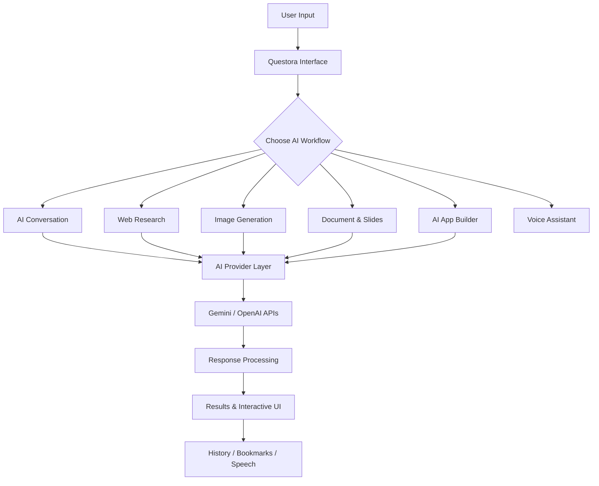

# ✦ QUESTORA AI

### Intelligence Designed to Evolve

<p align="center">
  
</p>

<p align="center">
  <b>A next-generation AI workspace for research, creativity, productivity, and intelligent conversations.</b>
</p>

<p align="center">
  <a href="https://questora-eta.vercel.app/">
    
  </a>
  
  
</p>

---

## 🧠 About Questora

**Questora AI** is an intelligent, multi-model AI platform designed to bring research, conversation, creativity, and productivity together in one unified workspace.

Powered by Google Gemini and OpenAI, Questora aims to make AI more useful by combining intelligent question answering, web-grounded research, voice interaction, content generation, and creative tools within a single interface.

From exploring complex topics to generating images, preparing presentations, formatting documents, and building mini web applications, Questora transforms ideas into practical outputs.

🔗 **Live Application:** https://questora-eta.vercel.app/

## ✨ Key Features

### 🤖 1. Multi-Model AI Intelligence

* Integration with Google Gemini and OpenAI models.
* AI-powered question answering and content synthesis.
* Model selection for different tasks.
* Structured explanations and research assistance.

### 🔎 2. Intelligent Web Research

* Search-oriented AI responses with Google Search grounding.
* Retrieval and synthesis of relevant web information.
* Verified web-source presentation and citation support.
* Quick facts, live-news exploration, and research follow-ups.

### 🎙️ 3. AI Voice Assistant

* Listen to AI-generated answers using speech synthesis.
* Multiple voice personas for different experiences.
* Adjustable narration speed and voice pitch.
* Continuous follow-up conversations and auto-speak options.

### 🎨 4. AI Image Generation

* Turn text prompts into creative visual concepts.
* Generate artwork, illustrations, and design ideas.
* Explore AI-assisted visual creativity.

### 📊 5. AI Presentation Generator

* Convert topics into structured presentation content.
* Generate organized slide-deck outlines.
* Prepare presentation material for further editing and export.

### 📝 6. AI Document & Project Hub

* Transform ideas and research into structured documents.
* Generate professional reports and project documentation.
* Prepare Word-compatible document outputs.

### 💻 7. AI App Builder Sandbox

* Describe an application using natural language.
* Generate single-file HTML, CSS, and JavaScript applications.
* Preview generated applications in an interactive sandbox.
* Download generated app code for further development.

### 📚 8. Search History & Saved Bookmarks

* Keep track of previous searches.
* Save useful content for later reference.
* Browse and filter saved records.
* Continue exploring previous research sessions.

### 🔐 9. Account & Personalization

* User sign-in and account creation interface.
* Personalized workspace controls.
* Voice and interface preferences.

## 🖥️ Explore the Platform

| Module              | Purpose                                     |
| ------------------- | ------------------------------------------- |
| AI Chat             | Ask questions and explore ideas             |
| Fastshot Search     | Research topics with web-grounded AI        |
| AI Models           | Explore Gemini and OpenAI integrations      |
| Image Generator     | Create visuals from text prompts            |
| Presentation Studio | Generate structured slide content           |
| Document Hub        | Prepare reports and project documents       |
| App Builder         | Generate and preview mini web applications  |
| Voice Assistant     | Listen to answers using customizable voices |
| Search History      | Revisit previous searches                   |
| Saved Bookmarks     | Keep useful information accessible          |

## ⚙️ How It Works



*Conceptual workflow illustrating the platform's main user journeys.*

## 🛠️ Technology Stack

The following technologies represent the main integrations and browser capabilities reflected in the application. Confirm the repository source code before treating the list as a complete implementation inventory.

<p align="center">
  
</p>

| Category            | Technology                                                       |
| ------------------- | ---------------------------------------------------------------- |
| AI models           | Google Gemini, OpenAI                                            |
| Web research        | Google Search grounding                                          |
| Voice interaction   | Browser speech synthesis and available speech input capabilities |
| Application hosting | Vercel                                                           |
| Web technologies    | HTML, CSS, JavaScript/TypeScript, and React where used           |

## 🚀 Getting Started

### 1. Explore the Live Application

Visit the deployed application:

**https://questora-eta.vercel.app/**

Explore the available AI models, research tools, voice features, creative utilities, and application-building workflow.

### 2. Run the Project Locally

To run the source project locally, clone your repository and install its dependencies.

```bash
git clone <YOUR_GITHUB_REPOSITORY_URL>
cd <YOUR_PROJECT_FOLDER>
npm install
```

Configure the environment variables required by your actual application. For example, if your backend uses these variable names:

```env
GEMINI_API_KEY=your_gemini_api_key
OPENAI_API_KEY=your_openai_api_key
```

Start the application using the script defined in your `package.json`:

```bash
npm run dev
```

The development command and local URL depend on your project's configuration. Check your `package.json` and backend setup before running these commands.

**Security:** Keep API keys in server-side environment variables. Never commit real credentials or expose secret keys in client-side code.

## 🔑 API Configuration

* **Google Gemini:** Create an API key through [Google AI Studio](https://aistudio.google.com/).
* **OpenAI:** Create an API key through the [OpenAI Platform](https://platform.openai.com/api-keys).

Enable only the integrations your application actually uses, and configure the corresponding environment variables on your deployment platform.

## 🌌 Project Vision

Questora aims to make AI more than a chatbot. It brings research, reasoning, voice interaction, content creation, and lightweight application development into a connected digital workspace.

The vision is simple:

* **Explore** information intelligently.
* **Create** content from ideas.
* **Interact** naturally through text and voice.
* **Build** useful applications with AI assistance.
* **Organize** knowledge for future use.

## 🔮 Future Possibilities

* Advanced conversational memory and personalized AI workflows.
* Improved source verification and research summaries.
* Multilingual voice conversations.
* More export formats for generated documents and presentations.
* Expanded app-generation capabilities.
* Additional AI providers and configurable workflows.

## 👨‍💻 Developer

**Souradip Roy Chowdhury**
*CSE Student | AI & Web Developer*

Interested in AI applications, intelligent assistants, web development, and building practical software experiences.

<p align="center">
  <a href="https://github.com/souradiproychowdhury-cpu">
    
  </a>
  <a href="https://linkedin.com/in/souradip-rc">
    
  </a>
  <a href="https://portfilonew-t7na.vercel.app/">
    
  </a>
</p>

---

<p align="center">
  <b>QUESTORA AI</b><br/>
  <i>Explore. Create. Build. Evolve.</i>
</p>
